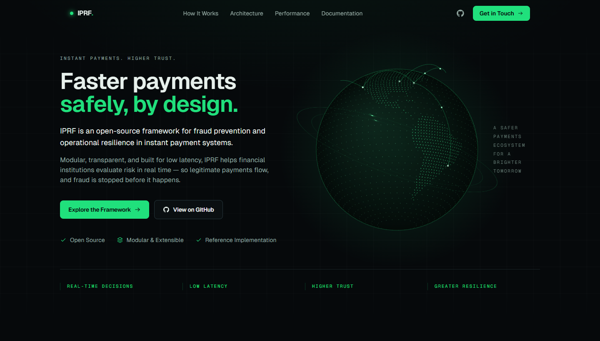
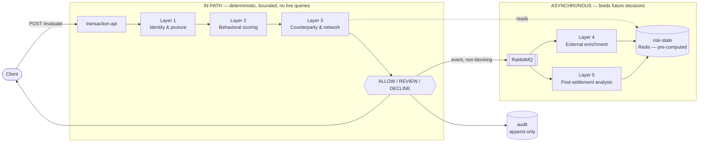

# IPRF — Instant Payment Fraud & Resilience Framework

**An open-source assessment framework and reference implementation for fraud prevention and operational resilience in irrevocable instant-payment systems.**

[](https://github.com/ronaldobinho/iprf-framework/actions/workflows/ci.yml)
[](LICENSE)
[](https://openjdk.org/projects/jdk/21/)
[](https://spring.io/projects/spring-boot)
[](https://nextjs.org/)

[**Live site**](https://iprf-payments.vercel.app) · [**Methodology**](https://iprf-payments.vercel.app/methodology) · [**Documentation source**](docs/framework)

[](https://iprf-payments.vercel.app)

---

## Status

**Pre-1.0.** This is an active reference implementation, not a released product. Being precise about the line, because the difference matters if you are evaluating it:

| Area | State |
|---|---|
| Decision engine, Layers 1–3 (in-path) | Implemented, runs locally |
| Layers 4–5 (async enrichment, post-settlement) | Implemented, event-driven |
| Immutable audit trail | Implemented |
| Assessment engine (12 categories, maturity 0–4) | Implemented |
| Methodology documents | Complete — 11 documents in [`docs/framework`](docs/framework) |
| Landing site + methodology rendering | Live |
| Dashboard and transaction explorer | Not built |
| Benchmarks (`backend/benchmarks`) | **Module exists, suite has not been run** |
| Public demo API | Not deployed |
| v1.0.0 tag | After benchmarks and the quality sweep |

**Every figure in this repository, on the site, and in the seeded local run is SYNTHETIC / DEMO DATA.** No number here is a benchmark result, a production measurement, or a claim about any institution. Where the framework states a latency figure it is a *design budget*, labelled as such.

---

## 1. What this is

Two things that depend on each other:

1. **A methodology** — how to assess fraud controls and operational resilience on an instant-payment rail. Eleven documents in [`docs/framework`](docs/framework), grounded in the public record and cited to primary sources. This is the primary artifact.
2. **A reference implementation** — a working, deterministic decision engine that demonstrates the methodology, so the claims are checkable rather than asserted. Java 21, Spring Boot 3, modular monolith.

It is built to be independently useful. Clone it, read the methodology, run a sample assessment and a local evaluation, with no commercial service involved.

## 2. Why instant-payment fraud is different

On a card or ACH rail, a suspicious payment can be investigated after the fact. Chargeback windows, reversal mechanisms and settlement delays give an institution days. Control design can assume an investigation window exists.

An instant payment settles in seconds and **cannot be recalled**. That removes the window, and three consequences follow:

- **The decision is the whole control.** There is no second look. Whatever the system concludes in the authorization path is final.
- **Latency is a correctness property, not a performance goal.** A control that is right but slow is a control that fails the payment.
- **False positives are failed payments.** Declining a legitimate transaction is not a conservative choice — it is an outage for that customer, at the moment they needed the rail to work.

Most fraud programs are optimised against losses prevented, a number that is easy to measure and easy to attribute. The cost on the other side of the ledger is diffuse and mostly unmeasured. IPRF treats both as first-class. See [`false-positive-model.md`](docs/framework/false-positive-model.md).

## 3. The one architectural principle

> **Decide before the transaction arrives what can be evaluated in-path, and what must be pre-computed or evaluated asynchronously.**

Everything else is downstream of that sentence. The failure it prevents is specific: a control that is correct in isolation but, placed on the authorization path, performs a query. Under normal load nobody notices. Under the load where it matters, the institution starts failing legitimate payments at exactly the moment it most needs to be working.

Concretely:

- **In-path (Layers 1–3)** — deterministic, bounded latency, pre-computed state only. **No live database query during authorization.** Layer 3 reads pre-computed risk state from Redis, never a synchronous lookup against the primary database.
- **Asynchronous (Layers 4–5)** — enrichment, external intelligence, heavy analytics, post-settlement analysis. Feeds *future* decisions. Never blocks the payment path.

The boundary is enforced, not just documented: an ArchUnit guard fails the build if the HTTP boundary starts making risk judgements, and a test asserts that a hanging enrichment registry cannot affect caller latency.

## 4. The five control layers

| Layer | Name | Path | Budget | What it evaluates |
|---|---|---|---|---|
| 1 | Identity & Account Posture | in-path | < 1 ms | Account age, verification, device, channel, history |
| 2 | Real-Time Behavioral Scoring | in-path | < 5 ms | Amount, counterparty, timing, channel, velocity |
| 3 | Counterparty & Network Signals | in-path | < 5 ms | Pre-computed counterparty risk state, network relationships |
| 4 | External Enrichment | async | background | External intelligence, sanctions and watchlists, context |
| 5 | Post-Settlement Analysis | async | continuous | Typology detection, pattern discovery, feedback to future decisions |

Budgets are design targets. Full definitions in [`fraud-control-layers.md`](docs/framework/fraud-control-layers.md); the latency reasoning is in [`latency-model.md`](docs/framework/latency-model.md).

## 5. Architecture



The event is published after the decision is made; the publisher hands off to an executor and returns, so nothing downstream can affect the caller's latency.

Detail in [`architecture.md`](docs/framework/architecture.md).

## 6. Example transaction

```bash
curl -s http://localhost:8080/api/v1/transactions/evaluate \
  -H 'Content-Type: application/json' \
  -d '{
    "transactionId": "txn_demo_001",
    "payerAccountId": "acct_123",
    "payeeAccountId": "acct_987",
    "amount": 125.00,
    "currency": "USD",
    "channel": "MOBILE_APP",
    "rail": "FEDNOW",
    "deviceId": "dev_a1b2c3",
    "initiatedAt": "2026-09-09T14:31:07Z"
  }'
```

## 7. Example decision

Nothing is omitted for brevity — a response reporting only the decision and the score would be a black box with extra steps. The contributing factors, the per-layer detail and the rule versions are the point.

```jsonc
{
  "transactionId": "txn_demo_001",
  "correlationId": "3f8c…",
  "decision": "REVIEW",           // ALLOW | REVIEW | DECLINE
  "riskScore": 0.42,              // composite, in [0, 1]
  "latencyMs": 0.412,             // measured in-path pipeline duration
  "latencyMicros": 412,
  "riskFactors": [                // highest contribution first
    { "code": "…", "layer": "…", "contribution": 0.00, "ruleVersion": "…" }
  ],
  "layerResults": { "…": { } },   // per-layer detail, ordered by layer
  "explanation": "…",
  "degraded": false,              // true when a layer ran on incomplete input
  "frameworkVersion": "0.1.0-SNAPSHOT",
  "evaluatedAt": "…"
}
```

Deterministic: the same input under the same rule versions always produces the same output. Thresholds live in configuration ([`application-rules.yml`](backend/risk-engine/src/main/resources/application-rules.yml)), not in code. There is no model, no black-box score, and no AI in the decision path — machine learning is an extension point, not a dependency.

## 8. Assessment methodology

An institution scores itself across **twelve categories**, each at a **maturity level from 0 to 4**. The assessment model defines the categories, the structure of a control, what counts as evidence, and how findings and recommendations are produced. Scoring rules live in configuration so the model can be adjusted without changing code.

- [`assessment-model.md`](docs/framework/assessment-model.md) — categories, controls, evidence
- [`maturity-model.md`](docs/framework/maturity-model.md) — the five levels and how scores compute

## 9. False positives

**A legitimate payment that is declined is a failed payment.** The framework tracks, and requires an institution to track, the detection rate *and* the false-positive rate, alongside decline / review / approval rates and p50 / p95 / p99 latency. Reporting one without the others describes half the system.

`REVIEW` exists because instant rails explicitly accommodate a fraud-suspicion hold — it is the mechanism that lets an institution be careful without failing the payment outright.

See [`false-positive-model.md`](docs/framework/false-positive-model.md).

## 10. Resilience

Fraud controls that are unavailable are not fraud controls. The resilience model assesses failure isolation, dependency coupling, recovery time, and whether remediation after an incident is permanent or ceremonial.

Its central thesis has its own document: **growth coupling** — when recovery time is a function of business volume. It is one of the few failure modes that gets steadily worse while every individual deployment looks fine, and it is invisible to the metrics most institutions watch.

- [`resilience-model.md`](docs/framework/resilience-model.md)
- [`growth-coupling.md`](docs/framework/growth-coupling.md)

## 11. Threat model

For every typology specific to irrevocable instant payments, the threat model states which layer is supposed to catch it and what happens when that layer is absent. That makes coverage checkable rather than assumed. See [`threat-model.md`](docs/framework/threat-model.md).

## 12. Running it locally

Requirements: **JDK 21**, **Node 22**, **Docker**.

```bash
git clone https://github.com/ronaldobinho/iprf-framework.git
cd iprf-framework

cp .env.example .env          # local values, synthetic data only
docker compose up -d          # PostgreSQL 16, Redis 7, RabbitMQ

cd backend && ./gradlew build         # compile + tests
./gradlew :transaction-api:bootRun    # http://localhost:8080
```

A startup seeder loads synthetic payer profiles so a locally running API returns differentiated decisions instead of `REVIEW` for every unknown payer. It is demo data and is disabled outside local profiles.

The frontend:

```bash
cd frontend
npm ci
npm run dev                   # http://localhost:3000
```

## 13. Docker

[`docker-compose.yml`](docker-compose.yml) provisions the three dependencies on an isolated network: PostgreSQL 16, Redis 7, RabbitMQ. Configuration comes from `.env`; see [`.env.example`](.env.example). Secrets are read from environment variables only — none are committed.

## 14. Tests

```bash
cd backend && ./gradlew test
```

Coverage is deliberate about the cases that break fraud pipelines in production rather than in demos: duplicate events, timeouts, dependency failure, stale risk state, and false-positive scenarios. Event handlers are idempotent and tested as such. An ArchUnit rule guards the in-path contract.

The frontend currently has no test suite — `npm test` runs with `--passWithNoTests`.

## 15. Benchmarks

The [`benchmarks`](backend/benchmarks) module is where JMH microbenchmarks and a load harness will live, with a reproducible `./gradlew benchmark` entry point writing results plus an environment fingerprint.

**It has not been run.** No latency number anywhere in this repository is a measurement. When the suite runs, results will be published with the exact command and environment that produced them, and never presented as numbers a reader cannot reproduce.

## 16. Live demo

The [landing site](https://iprf-payments.vercel.app) is a static export with no backend dependency: it explains the framework, walks a transaction through all five layers, and renders the methodology documents directly from [`docs/framework`](docs/framework) — the same files, not a summary rewritten for a website.

A publicly hosted demo API is on the roadmap. It does not exist yet; the API examples above are for a local run.

## 17. API

One endpoint today:

| Method | Path | Purpose |
|---|---|---|
| `POST` | `/api/v1/transactions/evaluate` | Evaluate a transaction, return an explainable decision |

With the API running locally:

- OpenAPI document — `http://localhost:8080/api/v1/openapi`
- Swagger UI — `http://localhost:8080/api/v1/docs`

Every decision is written to an immutable audit record carrying the transaction ID, framework version, rules executed with their versions, risk factors, decision, timestamp, latency, state version and correlation ID.

## 18. Project structure

```
backend/                 Gradle multi-module, Java 21, Spring Boot 3 — modular monolith
  transaction-api/       HTTP boundary, validation, correlation ID, OpenAPI
  risk-engine/           Layers 1–2, deterministic in-path rules
  risk-state/            Redis-backed pre-computed risk state
  network-risk/          Layer 3, counterparty and network signals
  external-enrichment/   Layer 4, asynchronous enrichment
  post-settlement/       Layer 5, pattern detection and feedback loop
  audit/                 Immutable append-only decision trail
  assessment-engine/     12 categories x maturity 0–4, configuration-driven
  benchmarks/            JMH microbenchmarks and load harness
frontend/                Next.js 14 App Router, TypeScript, Tailwind — static export
docs/framework/          The eleven methodology documents — the framework itself
specs/                   Phase specs used during development
```

Modules for later phases are declared empty on purpose: the architecture is visible from day one, and later work adds code inside those names rather than reshaping the build.

## 19. Security

Report a vulnerability privately — please do not open a public issue. The process, scope and disclosure expectations are in [`SECURITY.md`](SECURITY.md).

Practices in this repository: secrets via environment variables only, synthetic data only, PII minimisation by design, dependency and secret scanning in CI. The fraud typologies this framework defends against are documented openly in [`threat-model.md`](docs/framework/threat-model.md) — that is deliberate, since a control you cannot describe is a control you cannot assess.

## 20. Why this framework exists

The methodology comes out of building and operating payment and market infrastructure, not from a literature review. Two convictions shape it, and both are unusual enough to be worth stating plainly:

**Resilience belongs inside a fraud framework.** A fraud control that is unavailable is not a fraud control, and recovery time that scales with business volume is the failure mode nobody is watching. That is why [`growth-coupling.md`](docs/framework/growth-coupling.md) exists as its own document rather than a footnote.

**False positives are not an acceptable side effect.** They are failed payments, and on an irrevocable rail they are the failure the customer actually experiences.

> **Historical professional experience — not a result of this repository.** The growth-coupling thesis is informed by prior work on exchange infrastructure recovery time, where a startup sequence of roughly thirty minutes was reduced by approximately eighty percent through parallel processing, batch validation, and the removal of sequential dependencies. That work predates this project and is unrelated to the code here. Nothing in this repository has been benchmarked against it.

## 21. Roadmap

**v1.0.0** — benchmark suite executed and published with environment fingerprints; repository quality sweep; dependency and secret scanning blocking in CI; hosted demo API.

**v1.1** — operations dashboard and transaction explorer; interactive assessment wizard; additional typology detectors.

**Known limitations today** — synthetic data only; the external registry in Layer 4 is simulated; there is no authentication in the open core; the benchmark suite has not been run; the frontend has no automated tests.

## 22. Contributing

Issues and pull requests are welcome. Start with [`CONTRIBUTING.md`](CONTRIBUTING.md) for the build, test and PR conventions, and [`CODE_OF_CONDUCT.md`](CODE_OF_CONDUCT.md).

If you are assessing fraud controls on an instant-payment rail and something in the methodology is wrong, contradicted by a primary source, or missing — an issue saying so is the single most useful contribution.

## 23. Contact

| For | Where |
|---|---|
| Technical questions, bugs, methodology corrections | [GitHub Issues](https://github.com/ronaldobinho/iprf-framework/issues) |
| Professional enquiries | [LinkedIn](https://www.linkedin.com/in/ronaldocarvalho/) |
| Private correspondence | ronaldobinho@gmail.com |
| Security vulnerabilities | [`SECURITY.md`](SECURITY.md) — please do not use a public issue |

## 24. License

[Apache-2.0](LICENSE). Use it, adapt it, ship it. Attribution appreciated; a note about what you learned assessing your own rail, more so.
