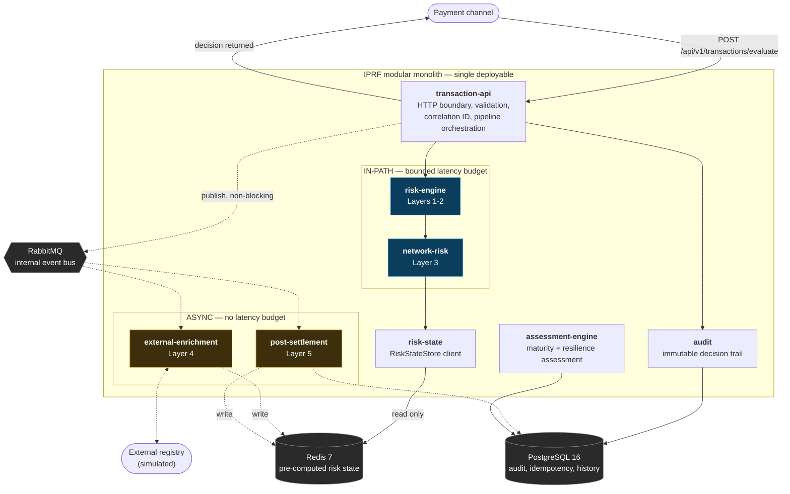
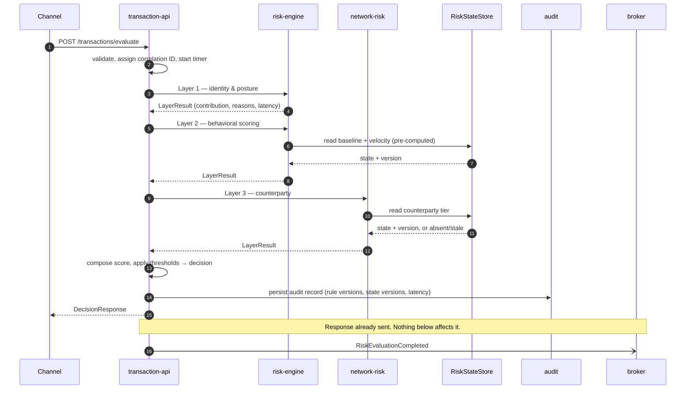
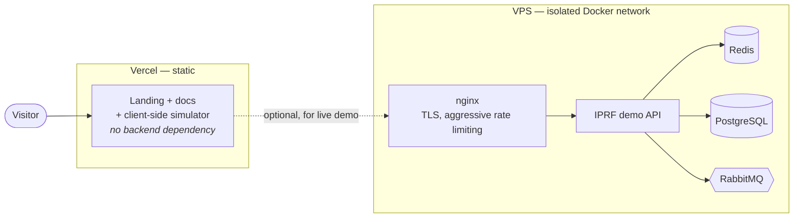

# Reference Architecture

The structure that makes the sync/async classification in
[`methodology.md`](methodology.md) enforceable rather than aspirational.

---

## 1. System overview

The dotted edges are the ones that matter. **Every dotted edge leaves the
payment path**, and the response to the client is returned before any of them
resolve.

---

## 2. Why a modular monolith

The five layers are frequently drawn as five services. This framework
deliberately does not build them that way.

**Because a network hop cannot fit the latency budget.** The in-path budget is
50 ms p99 for all three in-path layers combined (see
[`latency-model.md`](latency-model.md)). Splitting Layers 1–3 across services
adds two network round trips plus serialization to a budget that is mostly
consumed by one Redis round trip. Distribution would consume the budget it is
supposed to serve.

**Because distribution converts local failures into partial ones.** In-process
calls fail in one way. Network calls fail in several — timeout, partial
response, retry storm, cascading unavailability — and each mode needs its own
degradation design. The framework already requires explicit degradation for the
one dependency that genuinely must be remote (Redis). Adding two more remote
dependencies to the payment path multiplies that work for no benefit.

**Because the boundaries are what matter, not the deployment topology.** The
architectural discipline this framework insists on is the sync/async split. That
discipline is enforced by module boundaries and build-time architecture tests
— which work exactly as well inside one process as across many, and are
considerably easier to verify.

**Because the components have no independent scaling story.** Microservices earn
their cost when components scale independently. Layers 1–3 execute on exactly
the same trigger, exactly once each, on every transaction. Their load is
identical by construction.

The genuinely independent components — Layers 4 and 5 — are separated by the
**message broker**, which is the boundary that reflects a real difference in
execution model. That is the seam worth having, and the framework has it.

> **(D) Roadmap.** If Layer 5 analytics outgrows the monolith's resource
> envelope, it is the natural first extraction: it is already event-driven,
> already asynchronous, and already communicates only through the state store
> and the broker. The architecture is arranged so that extraction is possible,
> not so that it is required.

---

## 3. Module boundaries

| Module | Layer | Path | May depend on | Must **not** depend on |
|---|---|---|---|---|
| `transaction-api` | — | IN | risk-engine, network-risk, audit | — |
| `risk-engine` | 1–2 | IN | risk-state (read) | **JPA / repositories / HTTP clients** |
| `network-risk` | 3 | IN | risk-state (read) | **JPA / repositories / HTTP clients** |
| `risk-state` | — | both | Redis client | Primary database |
| `external-enrichment` | 4 | ASYNC | risk-state (write), broker, HTTP | transaction-api |
| `post-settlement` | 5 | ASYNC | risk-state (write), broker, JPA | transaction-api |
| `audit` | — | IN (write) | JPA | risk-engine, network-risk |
| `assessment-engine` | — | offline | JPA, config | in-path modules |
| `benchmarks` | — | offline | all | — |

### The constraint is enforced by the build

The "must not depend on" column is not a code-review convention. An ArchUnit
test fails the build if `risk-engine` or `network-risk` imports a JPA or
repository type.

This matters because the in-path constraint is exactly the kind of rule that
erodes. It is violated by a well-intentioned change, under deadline, by someone
who needs one more piece of data and notices that a repository is right there.
The rule has to be enforced by something that does not have a deadline.

---

## 4. Decision pipeline

Steps 1–13 are the entire latency budget. Step 14 is fire-and-forget.

---

## 5. Event catalog

Internal events over RabbitMQ, JSON payloads with versioned schemas. Every
consumer is idempotent, keyed by event ID against an idempotency store in
PostgreSQL — duplicate delivery is a logged no-op, never a second side effect.

| Event | Published by | Consumed by | Purpose |
|---|---|---|---|
| `TransactionReceived` | transaction-api | audit | Arrival record |
| `RiskEvaluationCompleted` | transaction-api | external-enrichment, audit | Decision made; triggers async enrichment |
| `TransactionApproved` | transaction-api | post-settlement | Outcome |
| `TransactionReviewed` | transaction-api | post-settlement, audit | Routed to review |
| `TransactionDeclined` | transaction-api | post-settlement, audit | Outcome |
| `TransactionSettled` | settlement adapter | post-settlement | **Triggers Layer 5 analysis** |
| `ExternalRiskUpdated` | external-enrichment | risk-state | Layer 4 → pre-computed state |
| `FraudPatternDetected` | post-settlement | risk-state, audit | **Layer 5 → Layer 3 feedback loop** |
| `AssessmentCompleted` | assessment-engine | audit | Assessment run finished |

The two bold rows are the feedback loop described in
[`methodology.md`](methodology.md#3-the-five-control-layers). Everything else is
supporting traffic.

### Event design rules

| Rule | Reason |
|---|---|
| Events carry a stable `eventId` | Idempotency key |
| Events carry the `correlationId` of the originating request | End-to-end tracing across the async boundary |
| Schemas are versioned; fields are added, never repurposed | Consumers deployed at different times must not misread |
| No consumer publishes back onto a topic it consumes | Prevents cycles |
| Publication never blocks a response | The framework's core principle, at the transport layer |

---

## 6. Data stores

| Store | Holds | Read in-path? | Written in-path? |
|---|---|---|---|
| **Redis 7** | Pre-computed risk state: counterparty tiers, baselines, velocity counters, network flags — each versioned with a write timestamp | **Yes, exclusively** | Velocity counters only |
| **PostgreSQL 16** | Audit trail (append-only), idempotency keys, settled transaction history, assessment inputs and results | **Never** | Audit write only |
| **RabbitMQ** | Event transport | Never | Publish only, non-blocking |

### Versioning of risk state

Every entry carries a version and a write timestamp. Decisions record **which
version they read**.

Without this, an audit trail records the decision but not the belief that
produced it — and reconstructing a decision six months later against risk state
that has since been updated produces a different answer, silently. The version
is what makes the audit trail actually reconstructive rather than merely
descriptive.

---

## 7. Configuration

| File | Contains | Changeable without deployment |
|---|---|---|
| `application-rules.yml` | Rule thresholds, weights, decision boundaries, layer budgets, TTLs | **Yes — by design** |
| Assessment model config | Categories, controls, level criteria, gates, weights | Yes |
| `application.yml` | Infrastructure wiring | No |

`application-rules.yml` is a published interface, not an implementation detail:
Phase 5 generates the TypeScript simulator's constants from it at build time, so
the browser simulator and the Java engine cannot silently diverge. A CI parity
test asserts that both produce identical decisions and reason codes for the same
inputs.

---

## 8. Deployment topology

The landing page and simulator run entirely client-side, so the public
demonstration has **no dependency on the backend being up**. The demo API is
additive.

> **Security posture.** The demo API runs on an isolated Docker network with no
> volumes or credentials shared with any other service on the host, aggressive
> rate limiting on public endpoints, and **synthetic data only**. Deployment
> configuration lives in `deploy/` and is built in Phase 6.
