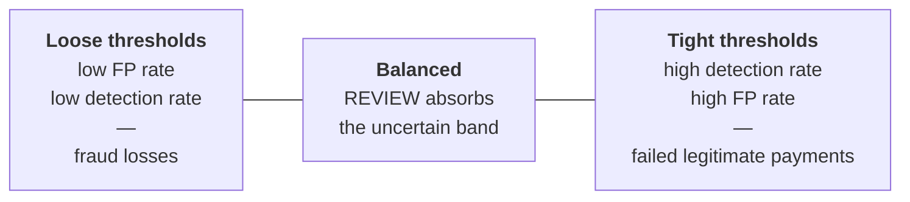

# False Positive Model

**A legitimate payment that is declined is a failed payment.**

This document defines how the framework treats false positives, why they are a
first-class concern rather than an acceptable side effect, and exactly how every
rate it reports is computed.

---

## 1. The asymmetry that most fraud programs get wrong

Fraud control is usually optimized against one number: losses prevented. That
number is easy to measure, easy to report, and easy to attribute. The cost on
the other side of the ledger — payments that should have succeeded and did not —
is diffuse, lands on a different team, and rarely appears in the same report.

The result is a systematic bias toward tightening. Every incremental threshold
tightening produces a visible reduction in fraud losses and an invisible
increase in failed payments.

On an instant rail this bias is more damaging than elsewhere, for a specific
reason: **there is no graceful recovery from a declined instant payment.** A
declined card authorization is a retry, or a different card, at the same
checkout. A declined instant payment is a customer standing in front of a
merchant, or facing a landlord, or at a hospital counter, whose money visibly
did not move — on a rail whose entire promise was that money moves instantly.
The failure is immediate, public, and attributed directly to the institution.

### 1.1 What a false positive actually costs

| Cost | Falls on |
|---|---|
| Failed payment, immediately visible to the customer | Customer |
| Manual review handling | Institution's operations |
| Support contact | Institution's service channel |
| Customer routes future payments elsewhere | Institution's revenue |
| Trust in the rail itself | The rail operator and every participant |

The last row is the one institutions under-weight. Instant-payment adoption
depends on the rail being reliable. Participants that decline aggressively
impose a cost on every other participant.

## 2. Why the receiving side now has skin in the game

Until recently, an institution hosting a mule account bore little direct cost
from doing so — the loss fell on the sending institution or the victim. That
changed in the UK.

Since **7 October 2024**, the UK Payment Systems Regulator's mandatory
reimbursement regime requires reimbursement of APP scam victims up to
**£85,000**, within **5 working days**, with the cost **split equally between the
sending and receiving payment firms**. A sending firm may apply an excess of up
to £100 per claim, which does not apply to vulnerable consumers.

The structural consequence is direct: **an institution is now financially liable
for the mule accounts it hosts.** Layer 3 (counterparty risk) and Layer 5
(post-settlement pattern detection) stop being defensive courtesies extended to
other banks and become controls with a measurable cost basis on the
institution's own balance sheet.

This is why the framework devotes two of its five layers to the receiving side
of the transaction, and why the fan-in mule detector in Layer 5 is treated as a
core capability rather than an advanced one. See
[`threat-model.md`](threat-model.md).

---

## 3. The tradeoff, stated honestly

Detection and false positives cannot be independently optimized. Every threshold
setting is a point on a curve.

An institution does not choose whether to make this tradeoff. It only chooses
whether to make it **explicitly, with measurement**, or **implicitly, by
accident**.

The framework's position: publish both numbers, always, from the same run. A
detection rate quoted without its accompanying false-positive rate is not a
result — it is a selected statistic.

### 3.1 `REVIEW` is what makes the tradeoff manageable

With only `ALLOW` and `DECLINE`, every transaction in the uncertain middle band
must be forced to one side, and both choices are wrong some of the time.

`REVIEW` converts that band from a binary error into a **cost**: operational
handling time, and delay for the customer. Delay is a genuine cost and should be
measured, not treated as free — but it is recoverable in a way that a wrongly
declined payment is not.

Both rails accommodate this explicitly. Pix grants a fraud-suspicion
authorization window of up to 30 minutes (08:00–20:00 Brasília, business days) or
60 minutes otherwise, requiring the payer be notified and offered cancellation.
FedNow provides "accept without posting" for the receiving side. The review path
is available; the framework's job is to route the right transactions into it.

The rate that matters here is the **review rate**: if it climbs, the institution
has shifted cost into operations rather than reduced error, and that must be
visible rather than hidden inside an improved decline rate.

---

## 4. Metric definitions

All rates are computed from a confusion matrix over a labeled transaction set.

|  | Actually fraudulent | Actually legitimate |
|---|---|---|
| **Flagged** (`DECLINE` or `REVIEW`) | True Positive (TP) | **False Positive (FP)** |
| **Not flagged** (`ALLOW`) | False Negative (FN) | True Negative (TN) |

### Core rates

| Metric | Formula | Reads as |
|---|---|---|
| **False positive rate** | `FP / (FP + TN)` | Share of legitimate payments that were flagged |
| **Detection rate** (recall / TPR) | `TP / (TP + FN)` | Share of fraudulent payments that were caught |
| **Precision** | `TP / (TP + FP)` | Share of flagged payments that were actually fraudulent |
| **Approval rate** | `ALLOW / total` | Operational |
| **Review rate** | `REVIEW / total` | Operational — the cost absorbed by humans |
| **Decline rate** | `DECLINE / total` | Operational |

### Definitional choices, stated because they change the numbers

**A `REVIEW` on a legitimate payment counts as a false positive.** It is a
legitimate payment that did not complete on the real-time path. Counting only
`DECLINE` as a false positive would let an institution move its FP rate toward
zero by routing everything to review — improving the metric while degrading the
customer experience it is supposed to represent.

Reported alongside it is the **hard false-positive rate** (`DECLINE` on
legitimate only), which isolates outright failures. Both are published. Neither
is published alone.

**Approval, review and decline rates are operational, not accuracy metrics.**
They describe throughput distribution and require no labels. They must never be
presented as evidence of effectiveness — a 99% approval rate is equally
consistent with excellent precision and with a disabled control.

### Latency percentiles

Reported at **p50 / p95 / p99**, never as averages. See
[`latency-model.md`](latency-model.md) for why those specific percentiles.

---

## 5. Ground truth, and why this repository can be honest about it

Every rate above requires knowing which transactions were actually fraudulent.
In production this is the hardest problem in fraud measurement: labels arrive
late, arrive incomplete, and are biased by the control itself — you never learn
the outcome of a payment you declined.

**This repository sidesteps that problem by not pretending to solve it.** The
synthetic transaction generator assigns each generated transaction a
ground-truth label at generation time. The confusion matrix is computed against
those labels.

That makes every rate this repository reports **exactly reproducible and exactly
as meaningful as the generator's realism** — no more. It is not evidence that
the rule set performs at any particular level against real fraud, and this
documentation does not claim otherwise.

> **(A) Implemented here.** The detection and false-positive rates produced by
> this repository are computed from **SYNTHETIC / DEMO DATA** with generator-assigned
> labels, under a fixed seed. They are reproducible measurements of the rule set
> against a known dataset. They are **not** production performance claims, and
> the generator is not a model of any real institution's traffic.

For institutions applying the methodology to real traffic, the assessment model
treats label quality as its own control: an institution that cannot state how it
obtains fraud labels cannot honestly report a detection rate, and the maturity
model caps its False-Positive Management score accordingly. See
[`assessment-model.md`](assessment-model.md) and
[`maturity-model.md`](maturity-model.md).

---

## 6. Reporting requirements

Any statement about performance made by this repository, or by an institution
following this methodology, carries:

1. **Both** detection rate and false-positive rate, from the same run
2. The **decision distribution** (approval / review / decline)
3. The **dataset** and its provenance, including seed if synthetic
4. The **rule set version** and configuration that produced it
5. The **latency percentiles** for the same run

A result missing any of these is incomplete. This is a documentation standard
the repository holds itself to — the benchmark and scenario commands emit all
five together, so producing a partial result requires deliberately discarding
part of the output.

---

## 7. Sources

- UK Payment Systems Regulator, *PS24/7: Faster Payments APP scams reimbursement requirement — confirming the maximum level of reimbursement* (October 2024) — [policy statement](https://www.psr.org.uk/publications/policy-statements/ps247-faster-payments-app-scams-reimbursement-requirement-confirming-the-maximum-level-of-reimbursement/)
- UK Payment Systems Regulator, *APP fraud reimbursement protections* — [consumer information](https://www.psr.org.uk/information-for-consumers/app-fraud-reimbursement-protections/)
- UK Finance, *Annual Fraud Report 2026* — [press release](https://www.ukfinance.org.uk/news-and-insight/press-release/fraud-report-2026-press-release)
- Banco Central do Brasil, *Manual de Tempos do Pix*, Versão 7.0, section 2 — [PDF](https://www.bcb.gov.br/content/estabilidadefinanceira/pix/Regulamento_Pix/IX_ManualdeTemposdoPix.pdf)
- Federal Reserve Financial Services, *FedNow Service Readiness Guide: Managing Fraud Risk* — [PDF](https://explore.fednow.org/resources/fraud-at-a-glance.pdf)
