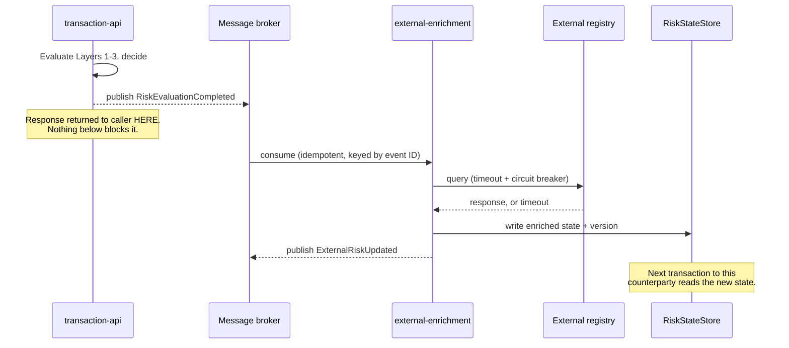
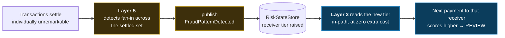

# Fraud Control Layers

Five layers, each specified by purpose, inputs, outputs, **path classification**,
and failure modes. The classification is the load-bearing part: it determines
what a layer is permitted to do, and what happens when it breaks.

See [`methodology.md`](methodology.md) for why the classification exists.

---

## Classification rules

A layer is **IN-PATH** only if it satisfies all of:

1. **Deterministic** — same inputs plus same rule versions produce the same
   output, every time, with no dependence on wall-clock timing or external state
   that can change mid-evaluation.
2. **Bounded** — has a declared latency budget and cannot exceed it.
3. **Pre-computed reads only** — in-memory structures or Redis. No query against
   the primary transactional database, no outbound third-party call.
4. **Degrades explicitly** — when its inputs are missing or stale, it emits a
   defined reason code and a neutral contribution. It never silently returns
   zero, and never blocks waiting.

A layer that fails any of these is **ASYNC**. There is no third category and no
exception process.

---

## Layer 1 — Identity & Account Posture

**Path: IN-PATH.** Budget: see [`latency-model.md`](latency-model.md).

### Purpose

Establish whether the account, device and channel are in a posture consistent
with initiating this payment at all. This is the cheapest layer and it runs
first, because a decisive answer here avoids the cost of everything downstream.

Layer 1 asks about the *payer's standing*, not about the payment.

### Inputs

All read from a pre-loaded account profile — never assembled by query at
decision time:

| Input | Purpose |
|---|---|
| Account age | Newly opened accounts carry disproportionate mule and takeover risk |
| Verification status | KYC completeness tier |
| Device identifier + known-device flag | Unrecognized device is a takeover signal |
| Channel | Mobile app, web, API, branch — each carries a different base rate |
| Historical behavior summary | Pre-aggregated: typical amount range, typical counterparty count, tenure of activity |
| Account status flags | Restrictions, prior confirmed-fraud markers, dormancy |

### Outputs

A `LayerResult` containing: contribution to the composite risk score, the list
of rules that fired with their reason codes, per-rule contribution, and measured
latency.

### Failure modes

| Mode | Behavior |
|---|---|
| Profile missing (unknown payer) | Treated as maximum-uncertainty posture, reason code `IDENTITY_PROFILE_MISSING`. Does **not** decline outright — an unknown profile is an operational gap, not evidence of fraud. Contributes elevated risk and typically routes to `REVIEW`. |
| Profile stale beyond TTL | Neutral contribution plus `IDENTITY_PROFILE_STALE`. Recorded on the decision so the audit trail shows the decision was made on degraded input. |
| Device identifier absent | Channel-appropriate default; absence is itself a weak signal, not an error. |

### The trap this layer sets for you

Account age and verification status are seductive because they are easy to
query. Querying them *at decision time* is the single most common way an
institution's fraud stack acquires a synchronous database dependency. The
profile must be materialized ahead of the transaction — that is the whole point.

---

## Layer 2 — Real-Time Behavioral Scoring

**Path: IN-PATH.** This layer carries the strictest latency budget, because it
does the most work.

### Purpose

Detect deviation from *this specific payer's* established baseline. Layer 1
asked whether the payer is in good standing; Layer 2 asks whether this payment
looks like something this payer would actually do.

Absolute thresholds ("flag anything over $10,000") are a weak control: they are
trivially learned and evaded by attackers, and they generate false positives
against legitimately high-value customers. Deviation from a personal baseline is
substantially harder to evade, because the attacker does not know the baseline.

### Inputs

| Input | Compared against |
|---|---|
| Transaction amount | Payer's baseline amount distribution (pre-aggregated mean/percentiles) |
| Counterparty identifier | Payer's set of known counterparties |
| Timestamp | Payer's typical transacting hours |
| Channel | Payer's typical channel; a switch is a signal |
| Rolling velocity counters | Payer's transaction counts per time window, held in pre-computed state |

### Rule families

| Family | Detects | Typical reason code |
|---|---|---|
| Amount deviation | Payment far outside the payer's normal range | `AMOUNT_DEVIATION_HIGH` |
| New counterparty | First-ever payment to this destination | `COUNTERPARTY_NEW` |
| Unusual hour | Payment outside the payer's active hours | `TIMING_UNUSUAL_HOUR` |
| Velocity | Burst of payments in a short window | `VELOCITY_WINDOW_EXCEEDED` |
| Channel switch | Payment on a channel this payer does not normally use | `CHANNEL_UNUSUAL` |

Each rule emits a bounded contribution. The composite score is the configured
combination of contributions, normalized to `0.0–1.0`. Every rule's individual
contribution is recorded, so the score is always decomposable — a score of 0.71
is never reported without the breakdown that produced it.

### Why these signals combine rather than fire independently

Any one of these signals alone is a poor predictor and a reliable
false-positive generator. A first payment to a new counterparty is what happens
every time someone pays a new landlord. A payment at 03:00 is what happens when
someone cannot sleep.

The same signals *together* — an unusually large amount, to a never-seen
counterparty, at an hour this payer is never active, from a device seen for the
first time — describe a scenario that is genuinely rare among legitimate
behavior. Composition is what converts weak signals into a usable one.

### Failure modes

| Mode | Behavior |
|---|---|
| Baseline missing (new payer, no history) | Deviation rules cannot fire meaningfully. Emit `BASELINE_INSUFFICIENT` and fall back to conservative absolute thresholds. New accounts are exactly where mule activity concentrates, so this must not silently resolve to "low risk". |
| Velocity counters unavailable | Neutral contribution, reason code recorded. Never a synchronous recount. |
| Budget exceeded | Layer is cut off at its timeout, partial result recorded with `LAYER_TIMEOUT`. |

---

## Layer 3 — Counterparty & Network Signals

**Path: IN-PATH, reading pre-computed state only.**

### Purpose

Answer "what do we already know about where this money is going?" — without
performing any lookup that could be slow.

This is the layer where in-path discipline is most often lost, because the
questions it wants to ask are naturally graph questions: *how many distinct
payers have sent to this account in the last hour? Is this account two hops from
a confirmed mule?* Those computations are genuinely expensive and genuinely
valuable.

The resolution is not to skip them. It is to **run them in Layer 5 and read
their results here.**

### Inputs

Read exclusively from the `RiskStateStore` (Redis-backed):

| Input | Written by |
|---|---|
| Counterparty risk tier | Layer 5 detection, Layer 4 enrichment |
| Receiving-account history summary | Layer 5 aggregation |
| Network behavior flags (fan-in, fan-out, structuring participation) | Layer 5 pattern detection |
| Previously reported typologies | Layer 4 external intelligence, confirmed-fraud feedback |
| State version and write timestamp | The store itself |

### Outputs

Contribution, reason codes, **and the risk-state version that was read**. That
version is recorded on the decision and in the audit trail: reconstructing why a
decision was made requires knowing what the system believed at that moment, not
what it believes now.

### Failure modes

| Mode | Behavior |
|---|---|
| No state for this counterparty | Neutral contribution, `NETWORK_STATE_ABSENT`. Absence of information is not evidence of safety, but neither is it evidence of risk — it is recorded honestly and other layers carry the decision. |
| State older than configured TTL | Neutral contribution, `NETWORK_STATE_STALE`. Explicitly **not** a blocking refresh and explicitly **not** a silent zero. |
| Redis unavailable | Layer degrades whole, `NETWORK_STATE_UNAVAILABLE`, decision proceeds on Layers 1–2. The payment path survives the loss of this layer by design. |

### Failure isolation is the design goal

A reasonable reading of this specification is "Layer 3 is weak — it can be
degraded away entirely." That is correct, and intentional. Layer 3 contributes
the most valuable signal *when it is available*, and contributes nothing harmful
when it is not. A control that takes down the payment path when its datastore is
unavailable has converted a fraud control into an availability incident.

---

## Layer 4 — External Enrichment

**Path: ASYNC. No latency budget, because it is never on the payment path.**

### Purpose

Incorporate intelligence that originates outside the institution — sanction and
watch lists, shared fraud registries, consortium signals, device reputation
services — into the pre-computed state that Layers 1–3 read.

### Why this cannot be in-path, stated precisely

An external call has three properties that are individually disqualifying:
unbounded latency (the remote service's p99 is not yours to control),
independent availability (its outage becomes your outage), and non-determinism
(the same transaction evaluated twice can get different answers). Any one of
these breaks the in-path contract in [`methodology.md`](methodology.md).

### Flow

### Inputs and outputs

**Inputs:** decision events, settlement events, scheduled refresh triggers.
**Outputs:** writes to `RiskStateStore` (versioned), `ExternalRiskUpdated`
events.

### Failure modes

| Mode | Behavior |
|---|---|
| External service slow or hanging | Timeout, circuit breaker opens, retry with backoff. **Decision latency is unaffected** — this is asserted by a test in which the enrichment stub is configured to hang. |
| External service returns error | Logged, retried, eventually dead-lettered. Existing state remains at its previous version rather than being cleared. |
| Duplicate event delivery | No-op. Every consumer is keyed by event ID against an idempotency store. |
| Enrichment permanently unavailable | State ages, TTLs expire, Layer 3 degrades to `NETWORK_STATE_STALE`. Degradation is gradual and visible, not sudden. |

---

## Layer 5 — Post-Settlement Analysis

**Path: ASYNC.**

### Purpose

Detect what no single transaction can reveal. Some of the most damaging
instant-payment fraud consists entirely of individually unremarkable payments —
each one small, each one to a plausible destination, each one correctly
authorized. The pattern exists only across the set.

### Detectors

| Detector | Pattern | Typology |
|---|---|---|
| Fan-in | Many unrelated payers → one receiver in a short window | Mule account collecting proceeds |
| Fan-out | One payer → many new receivers in a short window | Compromised account dispersing funds, or mule distribution layer |
| Structuring | Repeated amounts just below a known reporting or control threshold | Deliberate threshold evasion |
| Velocity burst | Settled-transaction rate far above an account's established pattern | Account takeover in progress |

See [`threat-model.md`](threat-model.md) for the full typology mapping.

### The feedback loop

This is the mechanism that makes the whole framework work:

The expensive graph analysis happened asynchronously. The in-path cost of
consuming its result is a single pre-computed read. **Nothing was traded away
except immediacy** — and immediacy was never available for this class of
detection anyway, because the pattern did not exist yet at the time of the first
payment.

### Failure modes

| Mode | Behavior |
|---|---|
| Detector produces a false pattern | Raises a counterparty's risk tier without justification, degrading future decisions. Mitigated by requiring detections to carry supporting evidence and by tier decay over time. |
| Analysis backlog | State ages. Layer 3 sees stale state and degrades explicitly rather than acting on outdated conclusions. |
| Duplicate settlement events | Idempotent consumers; a pattern is not counted twice. |
| Detector too sensitive | Directly inflates the false-positive rate on future transactions. Detector thresholds are configuration, and their effect is measured — see [`false-positive-model.md`](false-positive-model.md). |

---

## Layer interaction summary

| | L1 Identity | L2 Behavioral | L3 Network | L4 Enrichment | L5 Post-Settlement |
|---|---|---|---|---|---|
| **Path** | IN | IN | IN | ASYNC | ASYNC |
| **Reads** | Account profile | Baseline + velocity | RiskStateStore | External APIs | Settled history |
| **Writes** | — | Velocity counters | — | RiskStateStore | RiskStateStore |
| **Blocks payment?** | Yes | Yes | Yes | Never | Never |
| **Survives its datastore failing?** | Degrades | Degrades | Degrades | N/A | N/A |
| **Can take down the payment path?** | No | No | No | No | No |

The bottom row is the one to check when evaluating any real implementation. If
the answer for any layer is "yes", the classification has been violated
somewhere.
