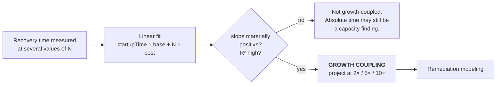

# Growth Coupling

> **Growth should not silently become a recovery-time multiplier.**

A system exhibits **growth coupling** when its recovery time is a function of
business volume. It is one of the few failure modes that gets steadily worse
while every individual deployment looks fine, and it is invisible to the metrics
most institutions watch.

---

## 1. The pattern

```
startupTime ≈ base + N × cost
```

| Term | Meaning |
|---|---|
| `base` | Fixed startup cost — process launch, framework initialization, connection establishment |
| `N` | A business-volume dimension: instruments, accounts, partitions, counterparty profiles, active rule sets |
| `cost` | Marginal startup cost per unit of `N` |
| `startupTime` | Time from process start to correct service |

When `cost > 0`, recovery time grows with the business. The institution has
built a system whose worst-case downtime increases every quarter it succeeds.

### Why it stays hidden

**It is not a bug.** Nothing is broken. Every startup completes successfully.
Tests pass. There is no error to alert on.

**It grows slower than attention.** Startup moving from 4 to 5 minutes over a
quarter is not noticeable. Over three years it is 30 minutes, and by then it is
perceived as an inherent property of the system rather than an accumulated
defect.

**It is measured in the wrong environment.** Startup time in development, CI, or
staging is measured against `N ≈ 0`. The measurement that matters — production
`N` — is taken only during incidents, when nobody is holding a stopwatch.

**Its cost is only paid during incidents.** The system restarts rarely. When it
does, the institution is already in an outage, and the recovery time is
attributed to the incident rather than to the design.

### Why a fraud system is especially exposed

The in-path layers depend on **pre-computed state loaded at startup**: account
profiles, baselines, counterparty risk tiers. That is what makes the latency
budget achievable — and it is exactly the kind of state whose volume tracks the
business.

The framework's central design decision therefore creates its own
characteristic risk, and this document exists because ignoring that would be
dishonest. A framework that mandates pre-computed state and stays silent on
what happens when that state gets large would be recommending the trap.

---

## 2. Detection

### 2.1 Measure at multiple scale points

A single recovery-time measurement is uninterpretable. Four minutes could be a
four-minute fixed cost or a two-minute base plus two minutes of coupled cost —
and those have completely different futures.

Detection requires recovery time measured at several values of `N`: across
environments with different data volumes, across partitions of different sizes,
or across time as `N` grows.

### 2.2 Fit and report

The analyzer fits a simple linear regression of `startupTime` against `N` and
reports:

| Output | Interpretation |
|---|---|
| `base` (intercept) | Fixed cost — the floor recovery time |
| `cost` (slope) | Marginal cost per unit of `N` |
| `R²` | How well linear growth explains the data |
| Projections at 2×, 5×, 10× current `N` | The finding that makes it actionable |

A high `R²` with a materially positive slope is the coupling finding. A slope
near zero — whatever the absolute recovery time — means the system is not
growth-coupled, which is a genuinely different situation: slow but bounded is a
capacity problem, and it does not get worse on its own.



### 2.3 Report the projection, not the current number

"Startup takes 6 minutes" invites the response that six minutes is acceptable.
"At current growth, startup reaches 30 minutes within N quarters, and that is
your worst-case outage floor" is a decision the institution can actually act on.

> **(A) Implemented here.** The analyzer and its projections are built in
> Phase 4 and operate on measurements **you supply**. This repository ships a
> synthetic dataset with deliberate coupling to demonstrate detection, and an
> uncoupled dataset to demonstrate that it does not fire spuriously. No number
> produced by this repository is a measurement of any real system.

---

## 3. Remediation

Three interventions, in the order they are usually available.

### 3.1 Parallel processing

**Applies when:** per-unit work is independent across units.

Sequential per-unit initialization is the most common source of coupling and
usually the easiest to fix, because independence is often already true and
merely unexploited.

```
before:  base + N × cost
after:   base + (N × cost) / workers + coordinationOverhead
```

The overhead term matters. Parallelism divides the coupled term but does not
eliminate it — `cost/workers` is still growth-coupled, just with a shallower
slope. **This buys time; it does not remove the pattern.**

### 3.2 Batch validation

**Applies when:** initialization performs per-unit round trips to a dependency.

`N` individual database round trips become `N / batchSize`. The reduction is
usually dramatic, because round-trip latency dominates per-unit compute by
orders of magnitude.

```
before:  base + N × roundTripLatency
after:   base + (N / batchSize) × batchLatency
```

Also still coupled, with a much smaller constant. Same caveat.

### 3.3 Removing unnecessary sequential dependencies

**Applies when:** work is on the startup critical path that does not need to be.

The highest-value intervention, because it is the only one that can drive the
coupled term toward zero rather than merely shrinking it:

- **Lazy loading** — load per-unit state on first use rather than eagerly for
  all `N`.
- **Deferred warm-up** — serve from a cold cache, warm asynchronously. Requires
  the system to be *correct* while cold, which the layer degradation model
  already provides.
- **External state** — hold pre-computed state in a store that survives restarts
  (Redis), so recovery is a reconnection rather than a reload.
- **Genuine removal** — validation performed at startup that could be performed
  at write time, or not at all.

The third is what the framework's architecture already recommends for a
different reason: **Layer 3 reads risk state from Redis rather than loading it
into process memory**, so restarting the decision service does not reload
counterparty state. The in-path constraint and the recovery-time property
turn out to have the same solution.

### 3.4 Ordering the interventions

| Intervention | Effect on slope | Effort | Removes coupling? |
|---|---|---|---|
| Batch validation | Large reduction | Low–Medium | No |
| Parallel processing | Divided by workers | Medium | No |
| Dependency removal | Toward zero | Medium–High | **Yes** |

Batching first, because it is usually cheapest per unit of slope removed.
Dependency removal last, because it is the only one that ends the problem —
and the only one worth calling a permanent remediation under
[`resilience-model.md`](resilience-model.md#24-incident-recurrence).

> **(A) Implemented here.** The remediation simulator (Phase 4) models each
> intervention and their combination against a supplied coupled profile, and
> emits projected recovery times. All figures it produces are **generated by the
> simulator from synthetic input** — never hand-typed, never presented as
> achieved outcomes.

---

## 4. Origin: the case that produced this model

> **(C) Historical case.** What follows is the author's documented professional
> experience. It is **not** a result produced, reproduced, or benchmarked by this
> repository.

**Context.** A critical system at B3, the Brazilian financial market
infrastructure operator, had a startup time of approximately 30 minutes. Because
the system was central to market operation, that startup time was the effective
floor on recovery from any incident requiring a restart.

**Root cause.** Initialization performed per-instrument validation sequentially,
with excessive database round trips per instrument. Startup time was therefore a
function of the number of instruments — a business-volume dimension that only
ever grew. The system had become slower every year the market grew, without any
individual change being responsible.

**Interventions.** Parallel processing of independent per-instrument work; batch
validation replacing per-instrument round trips; removal of sequential
dependencies that did not need to be on the startup critical path.

**Outcome.** Approximately 80% reduction in recovery time.

**The lesson that became this framework's thesis.** The original problem was
never described as a performance issue. It was described as "the system takes a
while to start", accepted as a property of the system. It was only when startup
time was recognized as a *function of business volume* that it became a defect
with a projection, and therefore a priority.

*Growth should not silently become a recovery-time multiplier.*

---

## 5. Applying this to your own system

Neither the case nor this repository tells you what your recovery time is. The
methodology is:

1. **Identify `N`.** What business dimension does startup work scale with?
2. **Measure at several values of `N`.** Different environments, different
   partitions, or the same system over time.
3. **Fit and project.** Is the slope materially positive? What is recovery time
   at 2×, 5×, 10×?
4. **Locate the coupled work.** Which initialization step is per-unit?
5. **Apply interventions in cost order.** Batch, parallelize, then remove.
6. **Re-measure.** A projected improvement is not an improvement.

Step 6 is the one that gets skipped, and it is the one that distinguishes a
permanent remediation from a plausible story about one.
