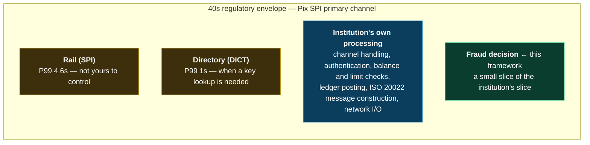

# Latency Model

The in-path layers operate inside a latency budget. This document derives that
budget from published rail requirements, allocates it across layers, and
specifies what happens when a layer exceeds its allocation.

> **(A) Implemented here / (D) Roadmap.** The budget *allocations* below are this
> framework's design targets, derived and argued — not measurements, and not
> requirements imposed by any rail operator. Measured results replace the
> "measured" column when the benchmark suite runs (`./gradlew benchmark`,
> Phase 6). Until then that column reads *not yet measured*, and no number in
> this document should be quoted as a performance result.

---

## 1. What the rails actually require

These are published, citable constraints — the outer boundary any design must
respect.

### Pix (Brazil)

From the Banco Central do Brasil *Manual de Tempos do Pix*, Versão 7.0:

| Constraint | Value | Notes |
|---|---|---|
| **Maximum end-to-end settlement, SPI primary channel** | **40 seconds** | Measured from the moment the payer's institution receives the payment order (`t0'`) to settlement (`t4`). Transactions not settled within the limit **are rejected**. |
| Maximum, SPI secondary channel | 45 minutes | Scheduled Pix only |
| **Authorization window, fraud-suspected transactions** | **30 minutes** (08:00–20:00 Brasília, business days) / **60 minutes** otherwise | Payer must be notified and offered cancellation |
| Time consumed by the SPI itself | **P50 2.8s, P99 4.6s** | `(t2 − t1') + (t5a − t3')`, primary channel — the rail's own SLA |
| DICT key query | **P99 1 second** | Directory lookup |
| DICT key update | P99 5 seconds | |
| SPI availability target | 99.9% | Unavailability = ≥80% of settlement requests erroring for >36s |

Participant service-level indicators are assessed at **P50 and P99** for payer
user experience (classified Level 1, the most critical tier) and at **P50 and
P95** for institution-side initiation and authorization steps (Level 2).

### FedNow (United States)

FedNow does not publish an equivalent numeric envelope, but its risk-management
capability set is structurally informative: **network-level and participant-level
transaction limits, participant-defined negative lists, and account activity
thresholds configurable by value and velocity per customer segment** are all
*configuration evaluated against pre-computed state*. The Network Intelligence
API is explicitly described as a call made **prior to sending** a payment — not
a synchronous step inside settlement.

---

## 2. Deriving the budget

The 40-second Pix limit is a **rejection threshold, not a design target**.
Designing a fraud decision against it would be a category error: by the time an
institution is consuming seconds of that envelope, the payment has stopped being
instant from the customer's point of view, and the institution is failing its
own P50/P99 user-experience indicators long before it approaches the regulatory
ceiling.

The real constraint is subtractive. Of the 40-second envelope:

The fraud decision is **one step among many inside the institution's own share**,
and it is a step that runs on every single payment. It has to be small enough
that nobody has to think about it during capacity planning.

This framework therefore targets a **p99 of 50 ms for the complete in-path
pipeline** (Layers 1–3, including scoring and decision assembly). That figure is
chosen so the fraud decision is roughly **three orders of magnitude below the
rail's own P99 contribution** — small enough to be structurally irrelevant to
settlement timing, and small enough that a 10× regression is still not a
settlement risk.

An institution with different constraints should change this number. It lives in
configuration, and every layer budget below scales from it.

---

## 3. Budget allocation

| Layer | Path | Budget (p99) | Rationale | Measured |
|---|---|---|---|---|
| **1 — Identity & Account Posture** | IN | **5 ms** | Pre-loaded profile lookup plus a handful of comparisons. Cheapest layer, runs first. | *not yet measured* |
| **2 — Real-Time Behavioral Scoring** | IN | **25 ms** | Largest allocation: most rules, baseline comparisons, velocity window evaluation, score composition. | *not yet measured* |
| **3 — Counterparty & Network Signals** | IN | **15 ms** | One Redis round trip plus deserialization and tier evaluation. Dominated by network I/O to the state store. | *not yet measured* |
| Decision assembly, explanation, audit record construction | IN | **5 ms** | | *not yet measured* |
| **In-path total** | | **50 ms** | | *not yet measured* |
| **4 — External Enrichment** | ASYNC | **no budget** | Off-path by construction | n/a |
| **5 — Post-Settlement Analysis** | ASYNC | **no budget** | Off-path by construction | n/a |

Layers 4 and 5 have no latency budget. This is not an oversight — a budget would
imply they are on a path where time matters, and the entire point of their
classification is that they are not. What they have instead is *throughput* and
*freshness* requirements, which govern how stale Layer 3's reads become.

---

## 4. Timeout behavior

Exceeding a budget is a **defined, observable event**, never an exception that
propagates to the caller.

| Situation | Behavior |
|---|---|
| A layer exceeds its budget | Layer is cut off. Partial result recorded with reason code `LAYER_TIMEOUT`. Pipeline continues to the next layer. |
| The in-path total is exceeded | Decision is assembled from whatever completed. The decision records that it was made on incomplete evaluation. |
| A required pre-computed store is unavailable | Layer degrades whole with an explicit reason code (`NETWORK_STATE_UNAVAILABLE`). No retry, no blocking wait. |

### The rule that follows from irrevocability

**A timeout must never silently become an `ALLOW`.**

The default degradation for a timed-out layer is a *neutral* contribution, not a
*favorable* one. A pipeline that quietly approves whatever it failed to evaluate
has inverted its own purpose, and does so precisely under the conditions an
attacker would like to create. Where degradation removes enough signal that the
remaining layers cannot support a confident `ALLOW`, the configured fallback is
`REVIEW` — which the rails explicitly accommodate (Pix's fraud-suspicion
window; FedNow's "accept without posting").

---

## 5. Why in-path rules must be deterministic and pre-computed

Three independent arguments, each sufficient on its own.

**Latency is only bounded if the work is bounded.** A rule that issues a query
has a latency governed by the query planner, index state, lock contention, and
connection pool saturation — none of which are properties of the rule. It is
untestable in the sense that matters: passing under test load says nothing about
behavior under the load where it counts. A rule that reads a materialized value
and performs arithmetic has a latency you can actually bound.

**Correlated failure is the real risk.** Fraud attacks and volume spikes arrive
together, and both stress the same database the synchronous rule depends on. The
in-path dependency turns an attack into a latency incident and a latency
incident into failed legitimate payments. The pre-computed design means the
authorization path holds up while everything around it is under stress.

**Reproducibility is a requirement, not a nicety.** Every decision is persisted
with its inputs, rule versions and risk-state versions so it can be
reconstructed later — for dispute handling, for regulatory inquiry, for
debugging a false positive. A decision that depended on a live query cannot be
reproduced, because the queried data has moved on. Determinism is what makes the
audit trail meaningful rather than decorative.

---

## 6. What gets measured

Recorded on every decision and exposed as metrics:

| Metric | Granularity |
|---|---|
| Decision latency | p50 / p95 / p99, matching the percentiles Pix uses for participant SLA assessment |
| Per-layer latency | p50 / p95 / p99 per layer |
| Per-rule latency | For identifying which rule regressed |
| Timeout counts | Per layer, per reason code |
| Degraded-evaluation rate | Share of decisions made on incomplete input |

The percentile choice is deliberate: **P50 and P99 are the percentiles the Pix
regulation itself uses** for the Level-1 payer-experience indicators, and P95
appears in its Level-2 institution-side indicators. Reporting the same
percentiles the supervisor reports makes an institution's internal measurements
directly comparable to its regulatory position.

Averages are not reported anywhere in this framework. An average latency hides
exactly the tail that causes rejected settlements.

---

## 7. Sources

- Banco Central do Brasil, *Manual de Tempos do Pix*, Versão 7.0 — [PDF](https://www.bcb.gov.br/content/estabilidadefinanceira/pix/Regulamento_Pix/IX_ManualdeTemposdoPix.pdf) (sections 1.1, 1.2, 2, 5.1, 5.2, 6.1.1, 6.2.1, 6.2.2)
- Banco Central do Brasil, Resolução BCB nº 195, de 3 de março de 2022
- Banco Central do Brasil, Instrução Normativa BCB nº 243, de 16 de março de 2022, art. 18
- Federal Reserve Financial Services, *FedNow Service Readiness Guide: Managing Fraud Risk* — [PDF](https://explore.fednow.org/resources/fraud-at-a-glance.pdf)
- Federal Reserve Financial Services, *FedNow network intelligence API* — [press release](https://www.frbservices.org/news/press-releases/042326-fednow-network-intelligence-api-empowers-participants-payments-confidence)
