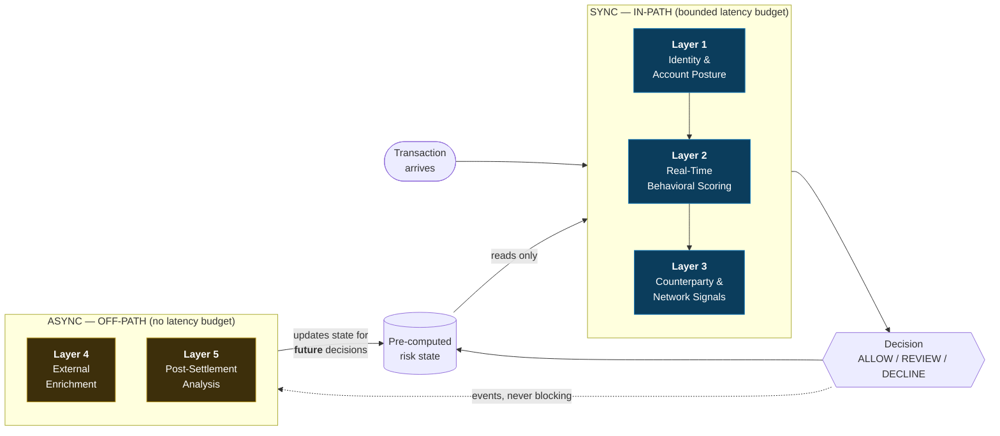

# IPRF Methodology

**Instant Payment Fraud & Resilience Framework — version 0.1.0**

This is the entry point to the framework specification. It states the problem,
the core architectural thesis, and the five control layers that follow from it.

| Document | Covers |
|---|---|
| `methodology.md` (this file) | Why instant-payment fraud is different; the sync/async thesis; the five layers |
| [`fraud-control-layers.md`](fraud-control-layers.md) | Each layer in detail: inputs, outputs, classification, failure modes |
| [`latency-model.md`](latency-model.md) | Latency and timeout budgets derived from published rail requirements |
| [`false-positive-model.md`](false-positive-model.md) | False positives as failed payments; metric definitions |
| [`assessment-model.md`](assessment-model.md) | The 12 assessment categories; controls, evidence, findings |
| [`maturity-model.md`](maturity-model.md) | Levels 0–4 and how scoring is configured |
| [`resilience-model.md`](resilience-model.md) | Recovery time, dependency coupling, incident recurrence |
| [`growth-coupling.md`](growth-coupling.md) | The `startupTime ≈ base + N × cost` pattern |
| [`architecture.md`](architecture.md) | Reference architecture, module boundaries, event catalog |
| [`threat-model.md`](threat-model.md) | Instant-payment fraud typologies and which layer mitigates each |
| [`terminology.md`](terminology.md) | Glossary |

---

## 1. Why instant-payment fraud is a different problem

Fraud controls in card and ACH systems were designed around a structural
assumption: **there is time**. A card authorization can be reversed through
chargeback rights measured in months. An ACH debit can be returned within
specified return windows. The control system is allowed to be wrong on Tuesday
because it can be corrected on Friday.

Irrevocable instant-payment rails remove that assumption. The Federal Reserve
states the design consequence plainly in its own readiness guidance for
participating institutions:

> "Systems designed to combat fraud involving payments that are cleared and
> settled in batches on predictable cycles may need updates to address fraud
> involving payments that clear and settle immediately."
> — *FedNow Service Readiness Guide, "Managing Fraud Risk"*

Three properties compound:

**Irrevocability.** Once settled, funds are gone. Recovery depends on the
receiving institution's cooperation and on the money still being there. Brazil's
Pix has a formal recovery mechanism — the *Mecanismo Especial de Devolução*
(MED) — but it is explicitly an investigation process, not a reversal right: the
two institutions have up to seven days to assess the claim, and funds are
returned only if fraud is confirmed and the money has not already moved on.

**Speed.** The window in which a control can act is measured in seconds. Under
the Pix regulation, a payment sent to the SPI primary message channel has a
maximum end-to-end limit of **40 seconds**, and transactions not settled within
that limit are rejected outright. Whatever fraud decisioning an institution
performs must fit inside a fraction of that envelope. See
[`latency-model.md`](latency-model.md) for the full budget derivation.

**Always-on.** There is no overnight batch in which to reconsider. Detection,
enrichment and analytics run against a system that never stops taking
transactions.

### 1.1 The consequence: fraud shifts from unauthorized to authorized

When stealing credentials stops paying — because the payment must clear a
real-time control and cannot be quietly reversed later — attackers stop
attacking the credential and start attacking the customer. The victim is
persuaded to authorize the payment themselves.

The UK, whose Faster Payments service has the longest operational record of any
major instant rail, publishes the clearest evidence of this shift. UK Finance's
*Annual Fraud Report 2026* recorded, for 2025:

| Measure | 2025 |
|---|---|
| Total payment fraud losses | £1.28bn (+4% year on year) |
| Authorised push payment (APP) fraud losses | £576.4m (+19% year on year) |
| APP fraud cases | 248,070 |
| APP share of total losses | 32% |
| APP cases originating online | 66% |
| APP cases originating via telecoms | 17% |

Two things matter here. First, APP fraud losses grew substantially faster than
total fraud losses — the authorized category is where the pressure is. Second,
**83% of APP cases originate outside the banking channel entirely**, online or
over the phone. The payment instruction itself is genuine, correctly
authenticated, and issued by the real customer. Authentication controls cannot
see this attack, because nothing about the authentication is wrong.

This is the fraud that instant rails concentrate, and it is the fraud that a
control framework for instant payments has to be built around.

---

## 2. The one non-negotiable architectural principle

> **Decide before the transaction arrives what can be evaluated in-path, and
> what must be pre-computed or evaluated asynchronously.**

Everything else in this framework is downstream of that sentence.

The failure mode it prevents is specific and common: a fraud control that is
correct in isolation but, placed on the authorization path, performs a live
database query, an external API call, or a graph traversal. Under normal load
it adds 40ms and nobody notices. Under the load where it matters — the
coordinated attack, the volume spike, the degraded dependency — it adds seconds,
and the institution starts failing legitimate payments at exactly the moment it
most needs to be working.

The principle forces the classification to happen at **design time**, where it
is a deliberate architectural choice, rather than at **incident time**, where it
is a rollback.

### 2.1 What the classification means in practice

**SYNC / IN-PATH (Layers 1–3)** — evaluated during authorization, inside a
bounded latency budget:

- Deterministic rules only. Given the same inputs and the same rule versions,
  the output is identical and reproducible.
- Reads **pre-computed state only** — in-memory or Redis-backed. No live query
  against the primary transactional database.
- No outbound network calls to third parties.
- Every layer has a timeout budget and a defined degradation behavior for when
  it is exceeded.

> **A note on Layer 3's classification.** Layer 3 is in-path — it is evaluated
> during authorization and contributes to the decision — but it carries a
> stricter restriction than Layers 1–2: it may read *only* the pre-computed
> counterparty risk state, never a synchronous lookup of any kind. Some
> summaries of this framework describe the in-path set as "Layers 1–2" and treat
> Layer 3 separately for that reason. Both readings describe the same design;
> this documentation states it as three in-path layers because all three run
> inside the same latency budget and all three can block a payment.

**ASYNC (Layers 4–5)** — evaluated off the payment path:

- External enrichment, third-party intelligence, heavy analytics, graph
  computation, post-settlement pattern detection.
- Feeds **future** decisions by updating pre-computed risk state. Never blocks
  the current payment.
- Free to be slow, free to fail, free to retry. A failure here degrades future
  decision quality; it does not fail a payment.

The boundary between them is not advisory. In this repository it is enforced
structurally: an architecture test fails the build if the in-path modules import
a JPA or repository type. See [`architecture.md`](architecture.md).

### 2.2 The rails already work this way

This is not a novel invention — it is a reading of what the rail operators
themselves have built, made explicit and testable.

**Pix** defines a two-speed model in regulation. The normal path is the 40-second
settlement envelope. But for transactions **under suspicion of fraud**, the
payer's institution is granted a materially longer authorization window: up to
**30 minutes** between 08:00 and 20:00 Brasília time on business days, and up to
**60 minutes** outside those hours — during which the payer must be notified and
must be offered the option to cancel. The regulator has, in other words, built an
explicit escape hatch from the real-time path into an asynchronous review path.

**FedNow** provides the same shape through a different mechanism. Among its
participant capabilities is **"accept without posting"**, a status a receiving
institution can return to indicate that further information is required before
accepting the payment. Alongside it sit participant-defined negative lists,
account activity thresholds configurable by value and velocity per customer
segment, and — since April 2026 — a Network Intelligence API that an institution
can call *prior to sending* to assess recipient risk.

Note what the FedNow control set has in common: **negative lists, thresholds and
segment configuration are all pre-computed state**. They are decided before the
transaction arrives. The Network Intelligence API is explicitly a *pre-send*
call, not an in-path one. The rails converged on the same answer this framework
formalizes.

### 2.3 Three outcomes, not two

Because both major rails provide a hold-and-review mechanism, the decision
contract has three outcomes rather than two:

| Decision | Meaning | Rail analogue |
|---|---|---|
| `ALLOW` | Proceed on the real-time path | Normal settlement |
| `REVIEW` | Hold for asynchronous assessment within the permitted window | Pix fraud-suspicion window; FedNow "accept without posting" |
| `DECLINE` | Reject | Rejection |

`REVIEW` is the outcome that makes the framework tractable. Without it, every
uncertain transaction must be forced into a binary at authorization time, and
the institution is choosing between fraud losses and failed legitimate payments
with no third option. See [`false-positive-model.md`](false-positive-model.md).

---

## 3. The five control layers

| # | Layer | Path | Answers |
|---|---|---|---|
| 1 | Identity & Account Posture | IN-PATH | Is this account, device and channel in a posture consistent with initiating this payment? |
| 2 | Real-Time Behavioral Scoring | IN-PATH | Does this payment deviate from this payer's established baseline? |
| 3 | Counterparty & Network Signals | IN-PATH (pre-computed reads) | What do we already know about where the money is going? |
| 4 | External Enrichment | ASYNC | What can outside intelligence add — for next time? |
| 5 | Post-Settlement Analysis | ASYNC | What patterns are only visible after the fact, across many transactions? |

The critical relationship is the loop between Layer 5 and Layer 3. Layer 5
detects patterns that no single transaction reveals — a receiving account
accumulating funds from many unrelated payers, for instance. It writes that
finding into pre-computed risk state. Layer 3 then reads it in-path on the
*next* transaction, at zero latency cost, because the expensive work already
happened.

**That loop is the framework.** It is how expensive analysis influences
real-time decisions without ever being on the real-time path.

Each layer is specified in [`fraud-control-layers.md`](fraud-control-layers.md).

---

## 4. What this framework refuses to do

These are deliberate constraints, not omissions.

**No black-box scoring.** Every decision carries the rules that fired, their
versions, their individual contributions, and a human-readable explanation. A
model that cannot explain a declined payment cannot be defended to the customer
who was declined, to the institution's risk committee, or to a regulator. ML is
supported as an extension point that produces *features consumed by explainable
rules* — never as an unexplainable verdict.

**No thresholds in code.** Rule weights and decision thresholds live in
configuration. Changing the amount at which a payment becomes suspicious is a
risk decision, not a software release.

**No live database queries in-path.** Stated above; enforced by build-time
architecture tests.

**No unlabeled metrics.** Every number this repository produces about detection
or false-positive rates is computed against synthetic data with ground-truth
labels, and is labeled as such. See
[`false-positive-model.md`](false-positive-model.md).

---

## 5. Origin of the methodology

This methodology was derived from the author's professional engineering
experience with instant-payment infrastructure — work on Brazil's Pix between
2019 and 2022 — and from a recovery-time engineering case at B3, the Brazilian
financial market infrastructure operator, in which a critical system's startup
time was reduced substantially by removing sequential per-instrument validation,
introducing parallel processing, and batching database round trips.

That case is documented in
[`resilience-model.md`](resilience-model.md) and
[`growth-coupling.md`](growth-coupling.md) because it produced the framework's
resilience thesis: *growth should not silently become a recovery-time
multiplier.*

**The framing matters, so it is stated explicitly.** That case study is the
author's historical professional experience. It is **not** a result produced,
reproduced, or benchmarked by this repository. What this repository contains is
a simulator that demonstrates the same *class* of remediation against synthetic
data, and an analyzer that detects the same *pattern* in measurements you
supply.

Throughout this documentation, four categories of claim are distinguished:

| Marker | Meaning |
|---|---|
| **(A) Implemented here** | Working code in this repository, verifiable by running it |
| **(B) Methodology** | Assessment approach derived from experience; not a software feature |
| **(C) Historical case** | Professional experience predating this repository; never a repository result |
| **(D) Roadmap** | Not built; stated as intent |

Where a document makes a claim that could be misread as a production result, it
carries one of these markers.

---

## 6. Sources

- UK Finance, *Annual Fraud Report 2026* (2025 data) — [press release](https://www.ukfinance.org.uk/news-and-insight/press-release/fraud-report-2026-press-release)
- Banco Central do Brasil, *Manual de Tempos do Pix*, Versão 7.0 — [PDF](https://www.bcb.gov.br/content/estabilidadefinanceira/pix/Regulamento_Pix/IX_ManualdeTemposdoPix.pdf)
- Banco Central do Brasil, Resolução BCB nº 195, de 3 de março de 2022; Instrução Normativa BCB nº 243, de 16 de março de 2022, art. 18
- Banco Central do Brasil, *Guia de implementação dos procedimentos de devolução (MED)* — [PDF](https://www.bcb.gov.br/content/estabilidadefinanceira/pix/Guia_MED.pdf)
- Federal Reserve Financial Services, *FedNow Service Readiness Guide: Managing Fraud Risk* — [PDF](https://explore.fednow.org/resources/fraud-at-a-glance.pdf)
- Federal Reserve Financial Services, *FedNow network intelligence API* (announced April 2026) — [press release](https://www.frbservices.org/news/press-releases/042326-fednow-network-intelligence-api-empowers-participants-payments-confidence)
